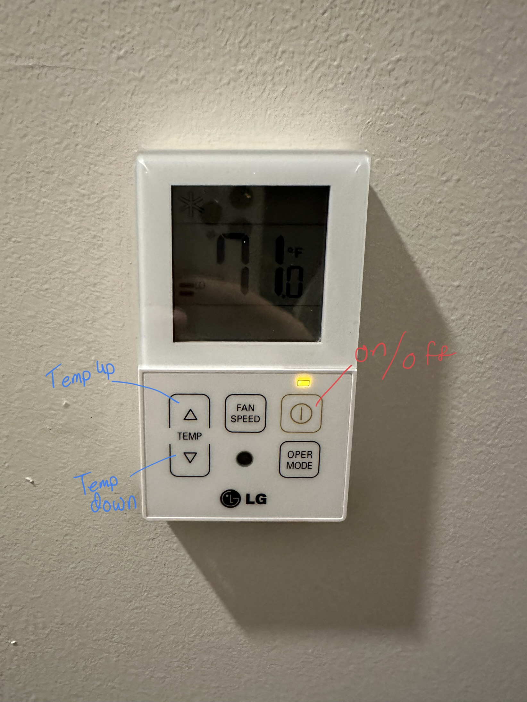

<span align="center">


# Switchbot Thermostat

<p>The Homebridge <a href="https://www.switch-bot.com">SwitchBot Thermostat</a> is an accessory plugin that allows SwitchBot Devices to control thermostats from HomeKit with
  <a href="https://homebridge.io">Homebridge</a>. 
</p>

<p></p>


</span>

## Installation

1. Prerequisite the [Homebridge Switchbot plugin](https://www.npmjs.com/package/@switchbot/homebridge-switchbot)
2. Install the this package (note: as of right now this package is not available on NPM)
3. `npm install -g alvst/homebridge-switchbot-thermostat`

## Configuration

1. Install/Configure the [Homebridge Switchbot plugin](https://www.npmjs.com/package/@switchbot/homebridge-switchbot) per [the instructions ](https://github.com/OpenWonderLabs/homebridge-switchbot#readme)
2. Configure all your Switchbot Bots to 'Multipress' mode
3. Place your Switchbot Bots onto the thermostat making sure they are able to hit the buttons.
4. Get a bearer token from Homebridge:

   a. A Bearer Token can be generated using Homebridge Swagger (/swagger#). I'd recommend creating a separate Homebridge user account in case your Bearer Token is leaked, you can remove that user account without it being your main/admin account.

   b. By default, Bearer Tokens only last 8 hours. I _strongly_ recommend making them last longer. Personally, mine rotates every 30 days. To me this is a reasonable middle-ground between security and convenience.

   c. The length of a Bearer Token's expiration can be changed in Homebridge → ⋮ → UI Settings → Advanced → Session Timeout (in seconds)

5. Configure the package.json by adding a new accessory:

```json
    "accessories": [
         {
            "accessory": "Thermostat",
            "name": "Thermostat",
            "thermostatDetails": {
                "minTemp": 15,
                "maxTemp": 30
            },
            "thermostat_configuration": {
                "bearerToken": "",
                "powerSwitchAccessoryUUID": "",
                "tempUpAccessoryUUID": "",
                "tempDownAccessoryUUID": ""
            },
            "debug": true,
            "customPort": 1234,
            "waitTime": 7000,
        }
   ]
```

## Required fields

| Key                        | Description                                                               | Required |
| -------------------------- | ------------------------------------------------------------------------- | -------- |
| `bearerToken`              | Bearer authentication Token for your Homebridge Installation              | `Yes`    |
| `powerSwitchAccessoryUUID` | Accessory Token UUID for you Switchbot that controls Power                | `Yes*`   |
| `tempUpAccessoryUUID`      | Accessory Token UUID for you Switchbot that controls temperature increase | `Yes`    |
| `tempDownAccessoryUUID`    | Accessory Token UUID for you Switchbot that controls temperature decrease | `Yes`    |

\* If you do not want to/need to control turning on and off your thermostat, make powerSwitchAccessoryUUID: n/a to avoid error messages.

## Thermostat Details Optional fields

| Key           | Description                                                                                                                                   | Default |
| ------------- | --------------------------------------------------------------------------------------------------------------------------------------------- | ------- |
| `maxTemp`     | Upper bound for the temperature selector in the Home app (in celsius)                                                                         | `30`    |
| `minTemp`     | Lower bound for the temperature selector in the Home app (in celsius)                                                                         | `15`    |
| `degreeUnits` | The temperature Units (Celsius or Fahrenheit) that your thermostat is set to. °C (0) or °F (1) for units.                                     | `1`     |
| `minStep`     | Increment value for the temperature selector in the Home app amount this value is in Celsius and other values are only supported for Celsius. | `.5`    |

## Other Optional Fields

| Key          | Description                                                                                                                                                                                                                                                                                                                                                 | Default |
| ------------ | ----------------------------------------------------------------------------------------------------------------------------------------------------------------------------------------------------------------------------------------------------------------------------------------------------------------------------------------------------------- | ------- |
| `waitTime`   | The amount of time between each (attempted) bot press. By default the value is 5000 milliseconds (5 seconds). The ideal time for you may vary based on how far your device is from your hub among other factors. I wouldn't recommend much less than 5 seconds as it will lead to more failed presses. If you are having failed presses, increase this time | `5000`  |
| `debug`      | Add additional logging messages                                                                                                                                                                                                                                                                                                                             | `false` |
| `customPort` | If your Homebridge Server is set to run on a port other than the default 8581, you can set that here (if you haven't set this manually, you can ignore this).                                                                                                                                                                                               | `8581`  |

## Thermostat Power States Key

| Number | Name |
| ------ | ---- |
| `0`    | Off  |
| `3`    | Auto |

- ### If using BLE Connection
  Right now, neither myself [(who created the multi-press functionality in the Switchbot Homebridge plugin)](https://github.com/OpenWonderLabs/homebridge-switchbot/pull/628), nor anyone else, has yet ported multi-press to support BLE so this extension doesn't yet work if you rely on Bluetooth. At some point, if no one else does, I will investigate implementing multi-press functionality compatible with Bluetooth but if you are interested in porting it, go ahead.

<p align="center">



</p>

## Supported Devices

You can use this thermostat with basically any thermostat that seems like it would be compatible. Also feel free to adapt it as needed. You may need to make slight modifications if the features I created aren't the exact features you created. You can see my Thermostat and it's capabilities above. Because of the limitations of HomeKit, I didn't leverage all the buttons (FANS SPEED which increase the fan speed, and OPER MODE which changes it from air conditioning to heat, etc). This plugin will work with any thermostat with temperature up and down buttons and a power on/off button. Additional actions are not currently supported but could easily be added in. I'd like to add fan speed, however, I don't believe that's currently supported by HomeKit/Homebridge Thermostats. Additionally, I have not implemented Heating and Cooling States because control of those is going to vary based on thermostat.

## Features

- Support for changing the temperature of your thermostat using 2 Switchbots
- Support for turning your thermostat On/Off using 1 Switchbot
- Fahrenheit (in 1 degree increments) and Celsius Support support.
- Full support for Queuing
  - This eliminates 'No Response' errors from HomeKit. It also enables you to send multiple requests like increase the temperature to 70 degrees, then increase the temperature again to 74 degrees.
- Full Automation Support
  - HomeKit Automations are sent in, an unfortunate order... When thermostats are already on, they send the 'Turn Off' request before sending the 'Change Temperature' request. I've fully dealt with this complexity, including fully supporting the power and temp state that your thermostat should be in.
- Full Fahrenheit support
  - Even if you have your thermostat set to Fahrenheit, HomeKit still send data in Celsius. This creates a lot of complexity because when converting to Fahrenheit, there may be two numbers in Celsius that relate to that number (for example both 22.0 and 22.5 convert to 72 degrees when rounding is taken into account). I've dealt with all this complexity so that at these numbers, only 1 request is sent to your Switchbots.

## Device Installation

Place one Switchbot Bot so it can activate the power button. Place one Switchbot Bot each on the of the temperature up and down buttons. Get the bayer tokens from homebridge swagger. Also, get the bearer tokens for the 3 Switchbot Bots. (See full instructions under Configuration.)

## Limitations

As mentioned, I developed this accessory plugin for myself. As such, it currently only supports Fahrenheit and increasing the temperature by 1 degrees F. Even if you have HomeKit set to Fahrenheit, HomeKit still operates as if it is in Celsius, this adds tremendous complexity and dealing with this complexity is responsible for about 33%-50% of the code in this plugin. Because of this limitations, adding support for intervals smaller than .5° Fahrenheit is not currently planned as it would be to complex for me to test unless I get a thermostat that has .5° intervals. I am open to pull requests that add this functionality.

Unfortunately, sometimes Switchbot's API fails to deliver requests to Switchbot Bots. This is a limitation that is out of my control and the control of the Homebridge-Switchbot plugin. I check my thermostat about once per day to make sure everything is in sync.

## Credits

This project was forked from <a href="https://github.com/phenotypic/homebridge-web-thermostat">Homebridge Web Thermostat</a> and leverages <a href="https://github.com/OpenWonderLabs/homebridge-switchbot">Homebridge-Switchbot</a> which includes an addition I developed to make this plugin possible.
